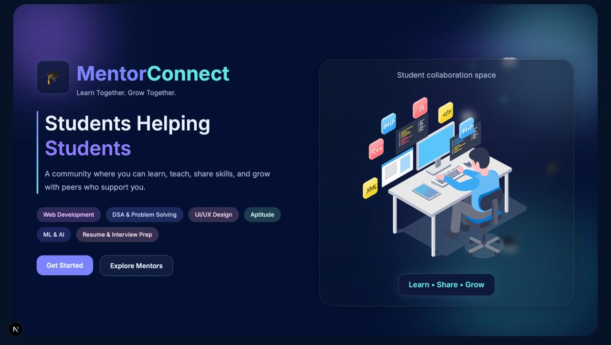
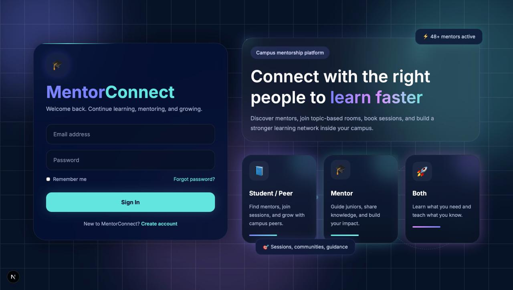
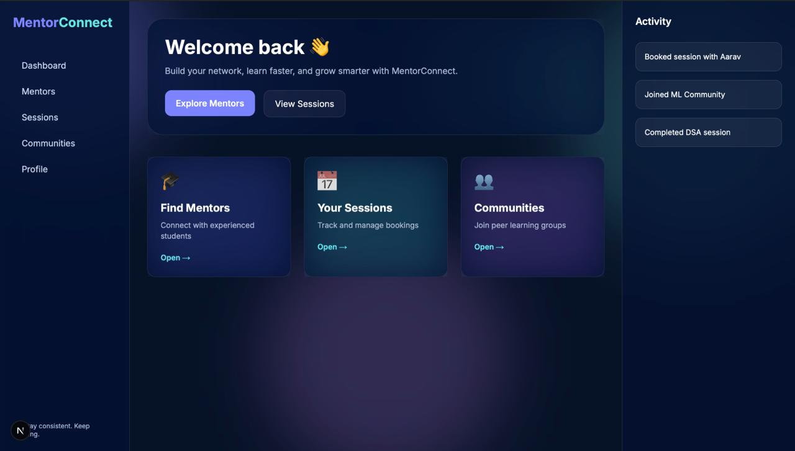
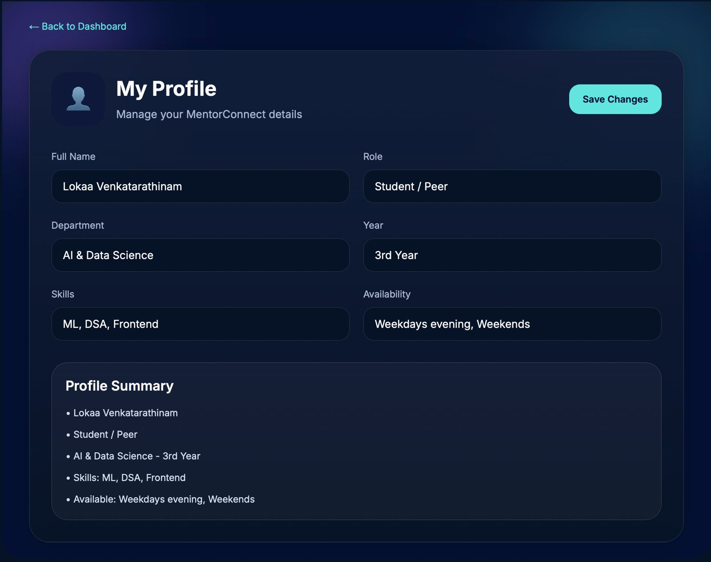
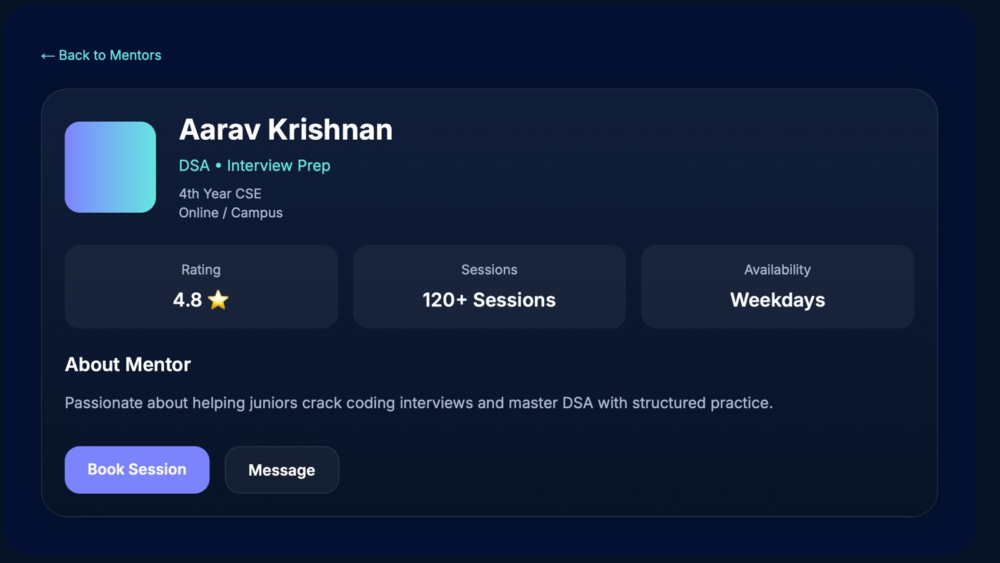
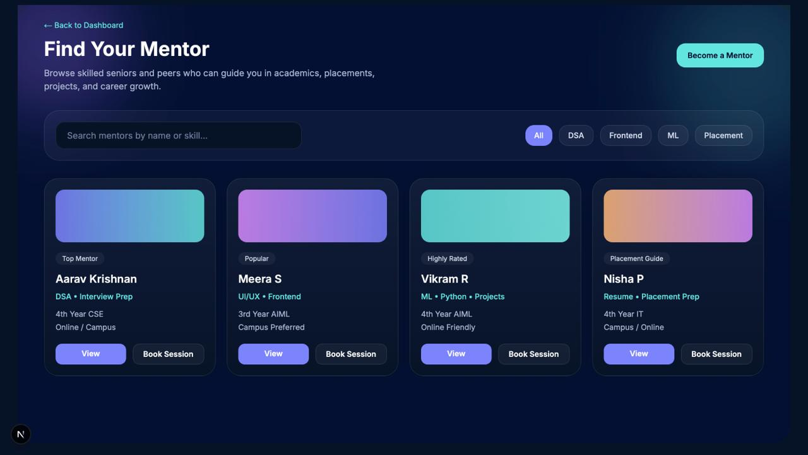
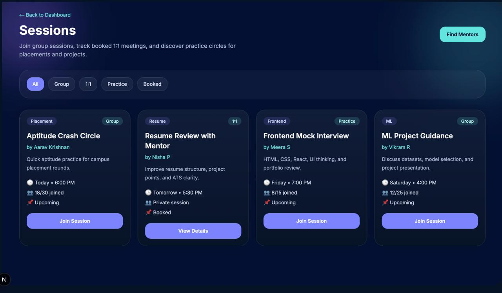
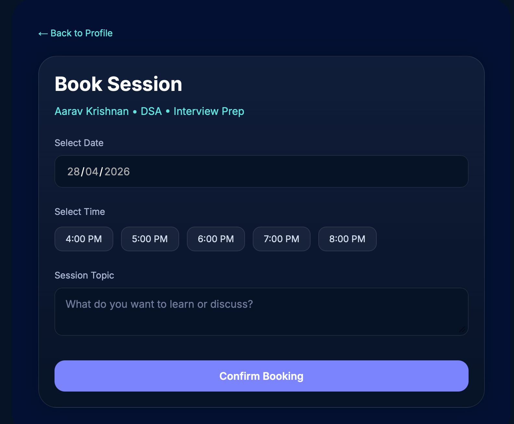
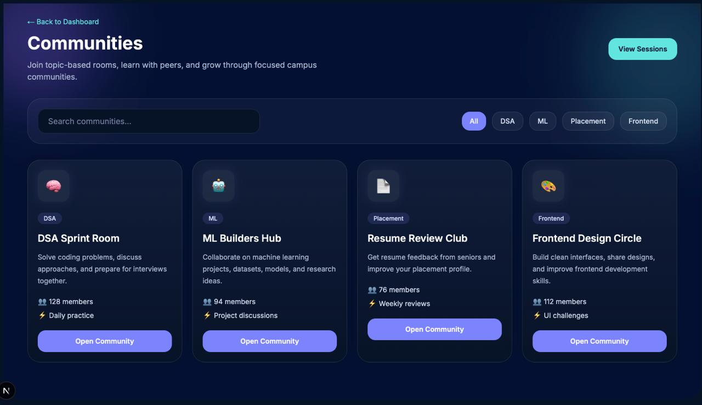

# Mentor Connect

A centralized peer mentorship platform that connects students based on skills, interests, and availability to enable structured academic and skill-based guidance within campus.

---

## Features

- Student login and profile management
- Mentor and mentee matching
- Skill-based mentorship discovery
- Availability-based connections
- Interactive dashboard
- Easy peer-to-peer communication
- Structured learning support system

---

## Problem Statement

Students often struggle to find reliable academic or technical guidance within college environments. Mentor Connect helps bridge this gap by creating a centralized mentorship ecosystem for peer learning and collaboration.

---

## Tech Stack

### Frontend
- React.js
- HTML5
- CSS3
- JavaScript

### Backend
- Node.js
- Express.js

### Database
- MongoDB

### Other Tools
- VS Code
- Git & GitHub

---

## System Architecture

User → Frontend → Backend API → Database

---

## Installation

### Clone Repository

```bash
git clone https://github.com/lokaavenkatarathinam-ux/mentor-connect.git
```

### Frontend Setup

```bash
npm install
npm start
```

### Backend Setup

```bash
npm install
nodemon server.js
```

---

## Future Enhancements

- AI-based mentor recommendations
- Chat system integration
- Video meeting support
- Progress tracking dashboard
- NLP-powered doubt assistance

---

## Screenshots

### Landing Page


### Login Page


### Dashboard


### Profile Page


### Mentor Profile


### Mentors Page


### Sessions Page


### Book Session


### Communities Page


## Author

LOKAA VENKATARATHINAM